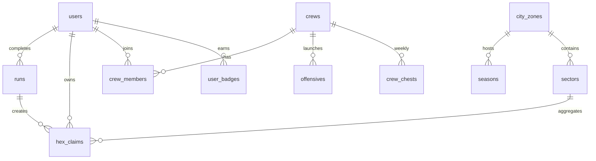

# Schéma base de données GRYD

**Migrations :** `supabase/migrations/0001`–`0017`  
**RLS :** activé sur toutes les tables user-facing  
**Écriture client interdite :** `runs`, `hex_claims` (service-role via Edge Functions)

---

## 1. Diagramme entités principales

---

## 2. Tables essentielles

### Territoire & runs

| Table | Clé | Rôle |
|-------|-----|------|
| `city_zones` | city_id | Villes (Paris, Lille), densité pioneer/active |
| `sectors` | id (H3 res-7) | Unité stratégique, agrégation carte |
| `hex_claims` | h3index (BIGINT) | Ownership H3 res-10, decay_at, shields |
| `runs` | id | Trace metadata, trust, celebration JSON |
| `no_capture_zones` | id | Autoroutes, zones interdites |
| `privacy_zones` | id | Masquage joueur |
| `outposts` | id | Points stratégiques |

### Joueurs

| Table | Rôle |
|-------|------|
| `users` | Profil, XP, level, streak, foulees, eclats |
| `user_profiles` | Visibilité, play_style, bio |
| `badges` / `user_badges` | Catalogue + déblocages |
| `missions` / `mission_progress` | Onboarding, daily, weekly |

### Crews

| Table | Rôle |
|-------|------|
| `crews` | Nom, code 6 chars, city, couleur index |
| `crew_members` | Adhésions (left_at nullable) |
| `crew_roles` | 7 rôles clan (migration 0013) |
| `crew_chests` / `crew_xp_daily` | Coffre hebdo, anti-farm |
| `offensives` / `defense_missions` | Missions crew |
| `partial_boundaries` | Frontières ouvertes crew |
| `boundary_contributions` | Parts fermeture |
| `crew_feed_events` | Fil crew |
| `group_runs` | Courses groupées |

### Économie & meta

| Table | Rôle |
|-------|------|
| `seasons` / `season_scores` | Saisons 8 semaines |
| `items` / `user_inventory` / `crew_inventory` | Arsenal 57 items |
| `purchases` | RevenueCat webhook |
| `active_bonuses` / `player_bonus_claims` | Bonus ciblés |
| `challenges` / `challenge_progress` | Défis solo/crew |
| `notifications` / `push_log` | Inbox + cap push |
| `referrals` | Parrainage |
| `waitlist` | Code postal web |

### Modération & sécurité

| Table | Rôle |
|-------|------|
| `anti_cheat_flags` | (via runs.status flagged) |
| Reports | Local MVP, RPC V1 |

---

## 3. Vues & RPCs

| Objet | Usage |
|-------|-------|
| `player_leaderboard` | Classement joueurs |
| `crew_leaderboard` | Classement crews |
| `sector_control` | MV agrégée secteurs (cron refresh) |
| `claim_hexes()` | Application atomique claims |
| `add_crew_xp()` | XP crew plafonnée |
| `grant_user_items()` | Récompenses |
| `refresh_crew_activity()` | Score activité |

---

## 4. Index critiques

- `hex_claims (h3index)` PK
- `hex_claims (owner_id, decay_at)` — decay job
- `runs (user_id, started_at DESC)`
- `runs (client_run_id)` UNIQUE — idempotence
- `crew_members (user_id) WHERE left_at IS NULL` — un crew actif

---

## 5. Politiques RLS (résumé)

| Table | SELECT | INSERT/UPDATE/DELETE |
|-------|--------|----------------------|
| `users` | self + public profile rules | self |
| `hex_claims` | authenticated (filtré privacy) | **service role only** |
| `runs` | self | **service role only** |
| `crews` | members + public discovery | members + roles |
| `crew_feed_events` | crew members | members |

---

## 6. Seed status (`0004_seed.sql`)

| Donnée | Statut |
|--------|--------|
| Paris, Lille | ✓ bounding box (TODO geo réelle O4) |
| Season 0 active | ✓ |
| Badges catalogue | ✓ |
| Missions onboarding | ✓ |
| Sectors | ✗ non seedés |
| no_capture_zones | ✗ non seedés |

---

## 7. Tables prompt maître vs existant

| Prompt | Existant | Note |
|--------|----------|------|
| territories | `sectors` + `hex_claims` | Modèle H3, pas polygons nommés |
| territory_cells | `hex_claims` | h3index BIGINT |
| territory_ownership | `hex_claims.owner_id` | |
| territory_events | `crew_feed_events` + runs | |
| captures / defenses | `hex_claims` outcomes | Via ingest_run |
| leaderboards | vues MV | |
| run_points | `runs.points` JSON + trace | Pas table points séparée |

---

## 8. Actions schema Phase 1

1. Seed `sectors` Paris/Lille (H3 res-7 grid)
2. Seed `no_capture_zones` minimum (périphérique, eau)
3. Cron refresh `sector_control` après ingest
4. RPC `hex_claims_in_bbox(minLat, maxLat, minLng, maxLng)` pour carte mobile
